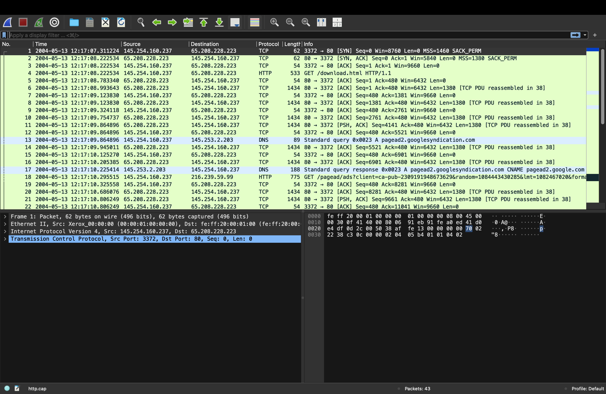
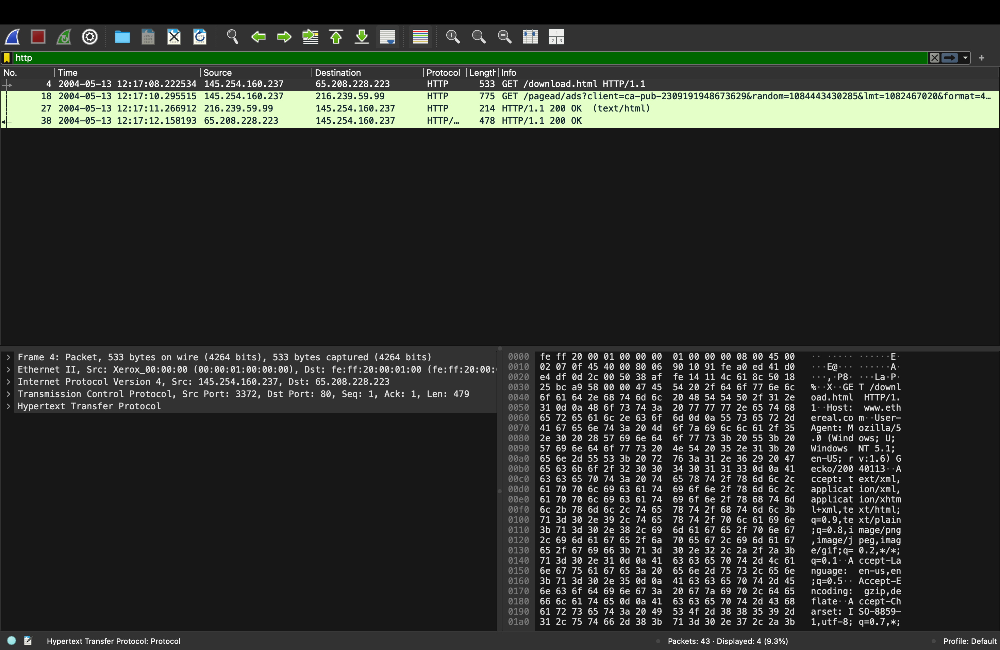
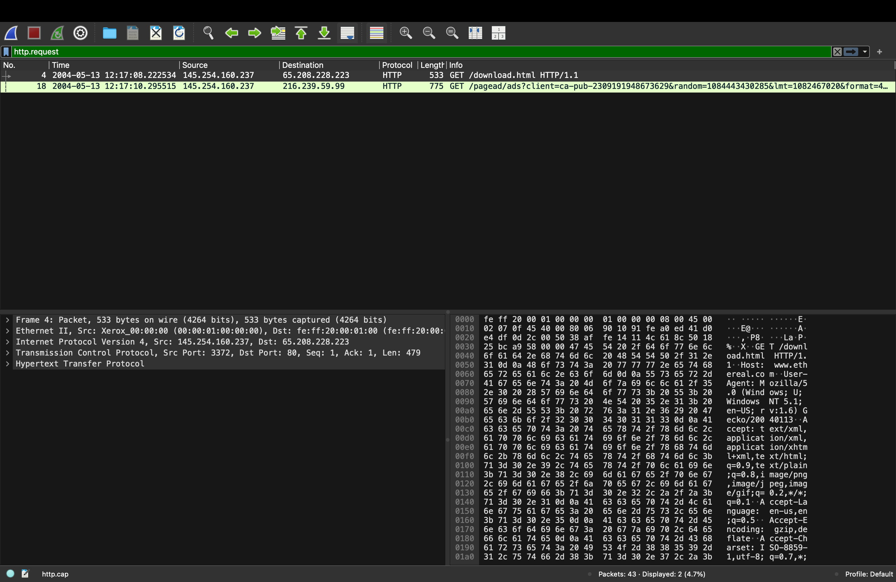
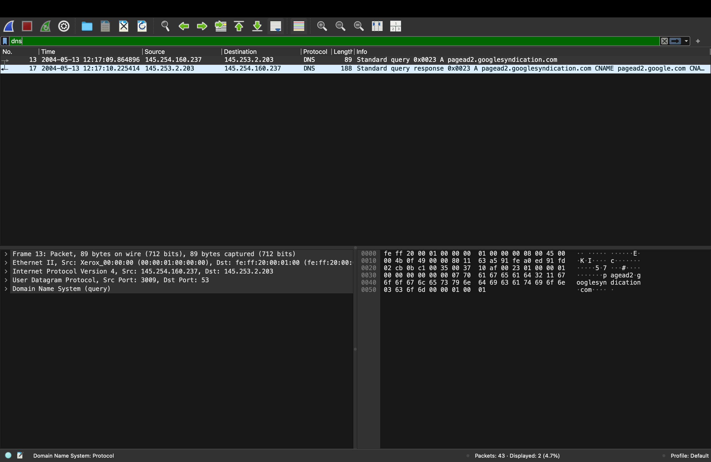
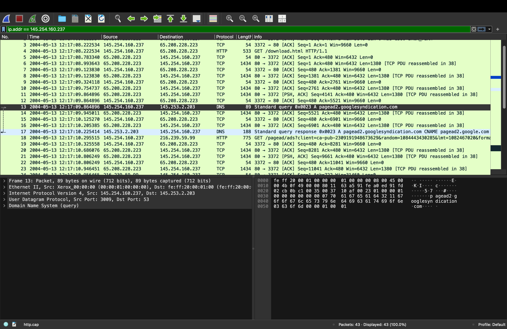
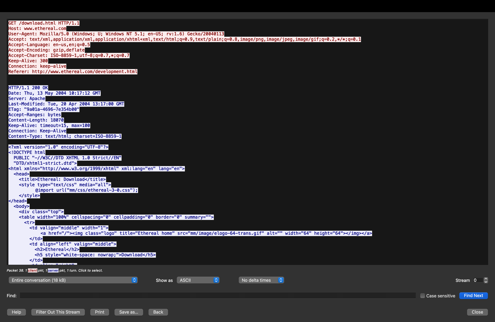
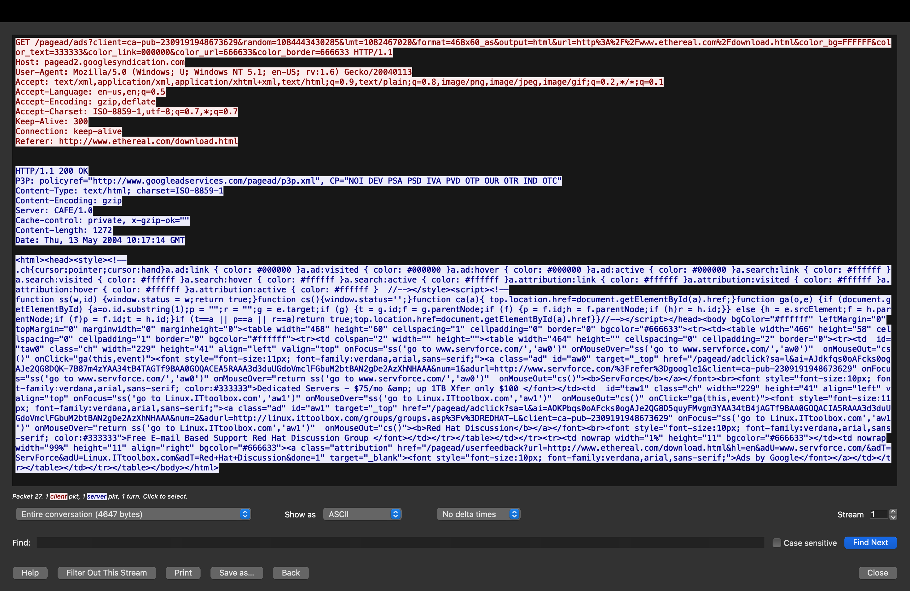
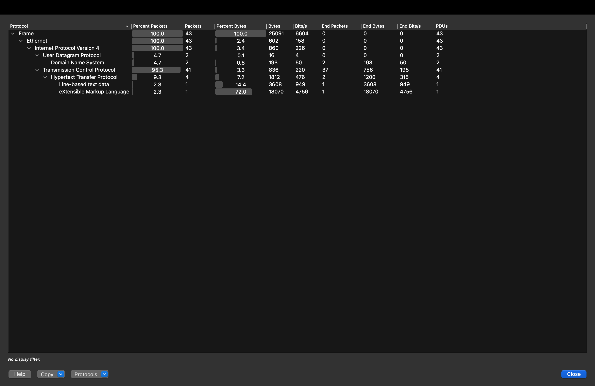
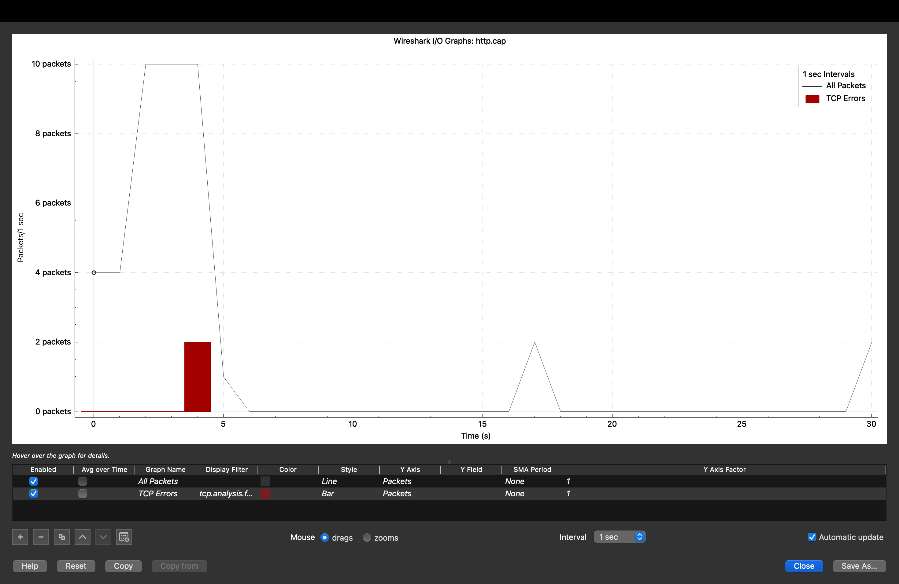
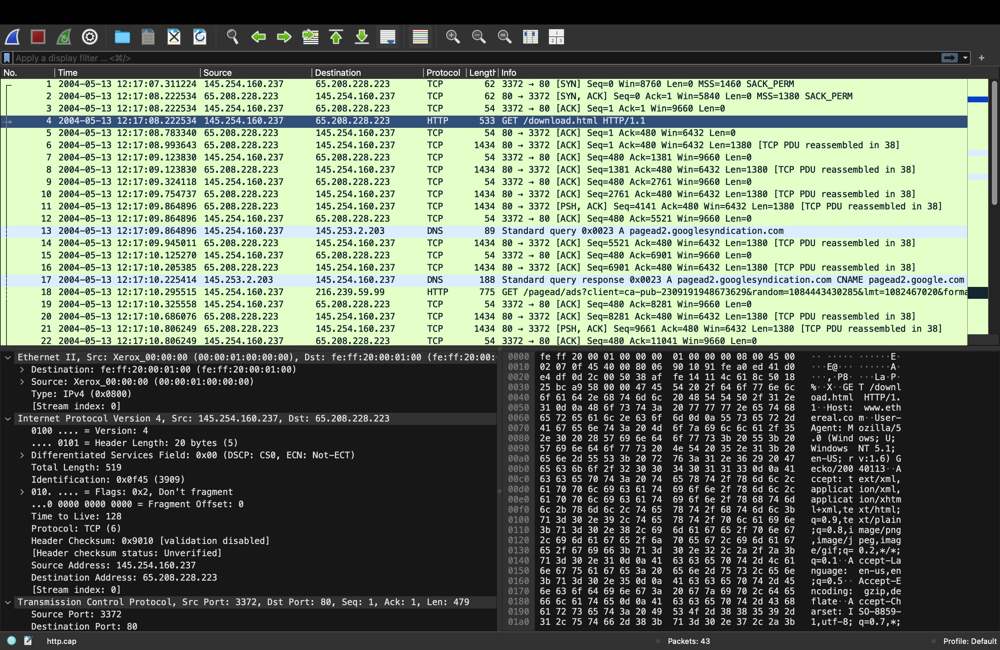

## Additional Analysis Screenshots

### Screenshot 01 — Full Capture Overview

*Complete http.cap loaded in Wireshark showing all 43 packets
with no filter applied. The full attack story is visible:*

| Packets | Event |
|---------|-------|
| 1-3 | TCP 3-way handshake — connection established |
| 4 | HTTP GET /download.html — first request |
| 5-12 | TCP data transfer — server sending response |
| 13 | DNS query for pagead2.googlesyndication.com |
| 17 | DNS response — CNAME resolved |
| 18 | HTTP GET /pagead/ads — Google ad request |
| 19-43 | Remaining TCP data and acknowledgements |

*Packet 1 detail visible at bottom: TCP SYN from port 3372
to port 80. Source MAC: Xerox_00:00:00 — client machine identified.*

---

### Screenshot 02 — HTTP Filter

*Filter: `http` — showing all HTTP packets including both
requests and responses. 4 packets displayed (9.3% of total).*

**HTTP packets visible:**
| Packet | Direction | Info |
|--------|-----------|------|
| 4 | Client → Server | GET /download.html HTTP/1.1 |
| 18 | Client → Ad Server | GET /pagead/ads?client=ca-pub-... |
| 27 | Ad Server → Client | HTTP/1.1 200 OK (text/html) — ad response |
| 38 | Web Server → Client | HTTP/1.1 200 OK — download.html response |

*Two requests and two responses visible. This immediately
shows the complete HTTP conversation — what was requested
and what the server returned.*

---

### Screenshot 03 — HTTP Requests Only

*Filter: `http.request` — showing only outbound HTTP requests,
no responses. 2 packets displayed (4.7% of total).*

**Only 2 HTTP requests in entire capture:**
- Packet 4: GET /download.html → www.ethereal.com
- Packet 18: GET /pagead/ads → pagead2.googlesyndication.com

*Filtering requests separately from responses is standard SOC
practice — it shows exactly what the client was trying to
access without the noise of response data.*

---

### Screenshot 04 — DNS Traffic

*Filter: `dns` — showing only DNS packets. 2 packets (4.7%).*

**DNS conversation:**
| Packet | Direction | Query | Type |
|--------|-----------|-------|------|
| 13 | Client → DNS server (145.253.2.203) | pagead2.googlesyndication.com | A record |
| 17 | DNS server → Client | pagead2.googlesyndication.com CNAME pagead2.google.com | Response |

*Only one domain was resolved in this session. The DNS server
IP is 145.253.2.203 — a different IP from the web server,
confirming it is a dedicated resolver.*

---

### Screenshot 05 — Client IP Filter

*Filter: `ip.addr == 145.254.160.237` — showing ALL traffic
involving the client IP. 43 packets displayed (100%).*

*Every single packet in the capture involves the client IP
145.254.160.237 — confirming this is a single-client capture
of one browsing session. All traffic flows between this client
and the three server IPs.*

*In a real SOC investigation, filtering by a suspicious IP
shows the complete picture of what that host was doing —
every connection it made, every byte it sent and received.*

---

### Screenshot 06 — HTTP Stream — Download Page

*Follow HTTP Stream on packet 4 — complete request/response
conversation for the download.html page.*

**Request captured:**
GET /download.html HTTP/1.1
Host: www.ethereal.com
User-Agent: Mozilla/5.0 (Windows; U; Windows NT 5.1; en-US; rv:1.6) Gecko/20040113
Referer: http://www.ethereal.com/development.html

**Response captured:**
HTTP/1.1 200 OK
Date: Thu, 13 May 2004 10:17:12 GMT
Server: Apache
Content-Length: 18070
Content-Type: text/html; charset=ISO-8859-1

**Page title from HTML:** `<title>Ethereal: Download</title>`

*The Referer header shows the user came from
/development.html before visiting /download.html —
this is normal navigation. Stream 0, 1 client packet,
1 server packet, entire conversation = 18kB.*

---

### Screenshot 07 — HTTP Stream — Google Ads

*Follow HTTP Stream on packet 18 — Google ad request
and response.*

**Ad request URL captured:**
GET /pagead/ads?client=ca-pub-2309191948673629
&random=1084443430285&lmt=1082467020
&format=468x60_as&output=html
&url=http%3A%2F%2Fwww.ethereal.com%2Fdownload.html
&color_bg=FFFFFF&color_text=333333
&color_link=000000&color_url=666633
&color_border=666633 HTTP/1.1
Host: pagead2.googlesyndication.com

**Response captured:**
HTTP/1.1 200 OK
Content-Type: text/html; charset=ISO-8859-1
Content-Encoding: gzip
Server: CAFE/1.0
Content-length: 1272

**Key findings from ad stream:**
- Publisher ID: ca-pub-2309191948673629 — identifies the
  website owner's Google AdSense account
- The URL parameter shows the ad was loaded from
  the download.html page
- Server: CAFE/1.0 — Google's internal ad server identifier
- Ad content was gzip compressed — standard web optimisation
- Stream 1, 4647 bytes total conversation

*SOC relevance: Ad network traffic is a common malvertising
vector. In a real investigation, the analyst would check
the ad server domain against threat intel and examine
the ad content for malicious scripts. Here the domain
is legitimate Google infrastructure.*

---

### Screenshot 08 — Protocol Hierarchy

*Statistics → Protocol Hierarchy showing complete breakdown
of all protocols in the capture.*

**Protocol breakdown:**
| Protocol | Packets | % Packets | Bytes | % Bytes |
|----------|---------|-----------|-------|---------|
| Frame | 43 | 100% | 25,091 | 100% |
| Ethernet | 43 | 100% | 602 | 2.4% |
| IPv4 | 43 | 100% | 860 | 3.4% |
| UDP | 2 | 4.7% | 16 | 0.1% |
| DNS | 2 | 4.7% | 193 | 0.8% |
| TCP | 41 | 95.3% | 836 | 3.3% |
| HTTP | 4 | 9.3% | 1,812 | 7.2% |
| Line-based text | 1 | 2.3% | 3,608 | 14.4% |
| XML | 1 | 2.3% | 18,070 | 72.0% |

**Key insight — XML is 72% of all bytes:**
The download.html file is structured as XHTML
(Extensible HTML following XML rules) — this single
file accounts for 18,070 bytes out of 25,091 total,
which is 72% of the entire capture by bytes.

*SOC relevance: Protocol hierarchy analysis instantly
reveals if unexpected protocols are present in traffic.
In a real investigation, seeing unusual protocols like
IRC, Tor, or non-standard ports in this view immediately
flags suspicious activity.*

---

### Screenshot 09 — IO Graph — Traffic Timeline

*Statistics → IO Graph showing packet rate over time
with TCP errors highlighted in red.*

**Traffic pattern observed:**
| Time (s) | Packets/sec | Event |
|----------|-------------|-------|
| 0 | 4 | Initial TCP handshake + first HTTP request |
| 1-4 | 10 (peak) | Server sending download.html response |
| 4-5 | 2 (red bar) | TCP errors — retransmissions |
| 5-14 | ~1 | Remaining data transfer |
| 15-16 | 2 | Google ad request burst |
| 25-30 | 2 | Final acknowledgements |

**Red bar at ~4-5 seconds — TCP errors detected:**
The red bar indicates TCP retransmissions or errors at
that point in the capture. This shows Wireshark detected
some packet delivery issues during the data transfer.

*SOC relevance: IO graphs reveal traffic patterns that
indicate attacks:*
- *Sudden traffic spike = DDoS or data exfiltration*
- *Flat line then sudden burst = beaconing malware*
- *Continuous high volume = active attack or flood*
- *Red TCP errors = network issues or attack traffic*

*In this capture, the pattern is consistent with normal
web browsing — an initial burst during page load, then
quieting down.*

---

### Screenshot 10 — Packet 4 Full Detail

*Complete expanded view of Packet 4 — the HTTP GET request —
showing all protocol layers from Ethernet to HTTP.*

**All four OSI layers visible:**

**Layer 2 — Ethernet:**
- Source MAC: Xerox_00:00:00 (00:00:01:00:00:00)
- Destination MAC: fe:ff:20:00:01:00
- Type: IPv4 (0x0800)

**Layer 3 — IPv4:**
- Source: 145.254.160.237 (client)
- Destination: 65.208.228.223 (web server)
- TTL: 128 — Windows default TTL
- Protocol: TCP (6)
- Don't fragment flag set

**Layer 4 — TCP:**
- Source Port: 3372
- Destination Port: 80 (HTTP)
- Seq: 1, Ack: 1
- Stream index: 0

**Layer 7 — HTTP:**
- GET /download.html HTTP/1.1
- Host: www.ethereal.com
- Full URI: http://www.ethereal.com/download.html

*SOC relevance: Reading all protocol layers is a
fundamental SOC skill. Each layer reveals different
information:*
- *Ethernet layer: which physical device sent the packet*
- *IP layer: source and destination networks, TTL (OS fingerprinting)*
- *TCP layer: which application ports are communicating*
- *Application layer: exactly what was requested or sent*

*TTL of 128 confirms Windows OS — Linux uses TTL 64,
Windows uses 128. This is passive OS fingerprinting
from packet headers alone.*

---

## Complete Analysis Summary

**Total screenshots taken:** 25
**Analysis techniques demonstrated:** 10
**Filters applied:** 6 different Wireshark filters
**Protocols analysed:** TCP, HTTP, DNS, UDP, Ethernet, IPv4

**What this lab demonstrates to a recruiter:**
- Ability to load and navigate packet captures
- Knowledge of Wireshark filter syntax
- Understanding of TCP/IP protocol stack
- HTTP stream reconstruction capability
- DNS analysis methodology
- Protocol hierarchy interpretation
- Traffic pattern recognition via IO graphs
- Packet-level protocol layer analysis
- SOC-relevant context applied to every finding
- Professional documentation of technical findings
