# Lab 01 — Wireshark HTTP Traffic Analysis
**File:** http.cap | **Date:** April 2026
**Tool:** Wireshark | **Total Packets:** 43
**Source:** Wireshark Sample Captures (wiki.wireshark.org)

---

## Objective
Analyse a real HTTP network capture using SOC analyst techniques —
identifying all network participants, mapping conversations, 
investigating HTTP requests, extracting transferred files, 
analysing DNS queries, examining TCP handshakes, checking 
User-Agent strings, and documenting findings.

---

## Network Overview

### IPs Identified
| IP Address | Role | Packets | Bytes |
|------------|------|---------|-------|
| 145.254.160.237 | Client — made all requests | 43 | 25 kB |
| 65.208.228.223 | Web server — www.ethereal.com | 34 | 21 kB |
| 145.253.2.203 | DNS server | 2 | 277 bytes |
| 216.239.59.99 | Google ad server | 7 | 4 kB |

---

## Task 1 — Endpoint Analysis
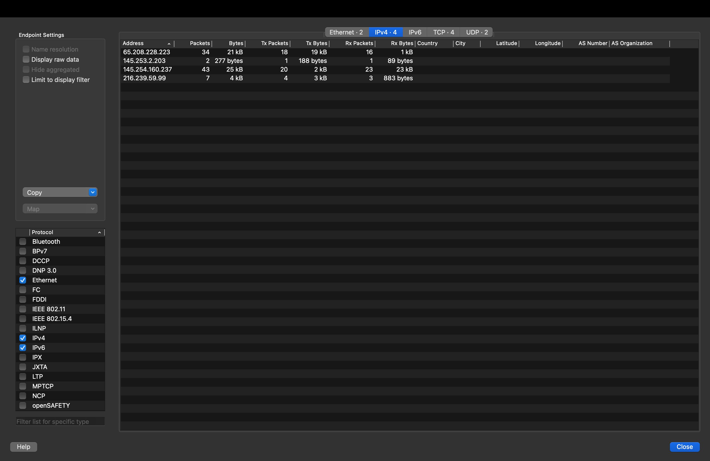
*Statistics → Endpoints → IPv4 tab showing all 4 unique IP 
addresses in the capture with packet and byte counts.*

**Findings:**
- 4 unique IPv4 endpoints identified
- Client IP 145.254.160.237 had the highest packet count (43)
- Web server 65.208.228.223 transferred the most data (21 kB)
- DNS server 145.253.2.203 only appeared in 2 packets — 
  one query, one response
- Google ad server 216.239.59.99 received 7 packets — 
  ad tracking traffic

**SOC relevance:** Endpoint analysis is the first step in any 
network investigation. Identifying all participants immediately 
reveals unexpected or suspicious IPs that should not be 
communicating with the target system.

---

## Task 2 — Conversation Mapping
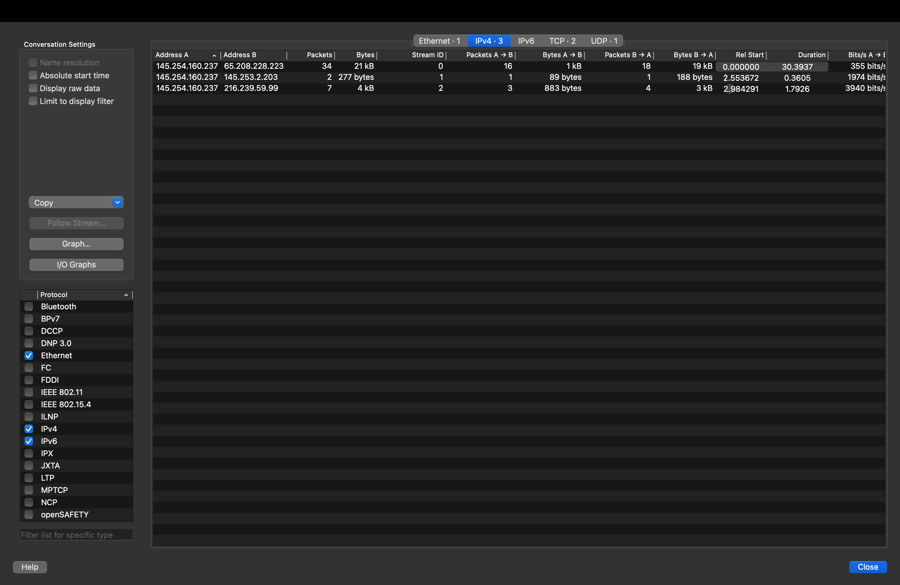
*Statistics → Conversations → IPv4 tab showing all IP pairs 
that communicated, with packet counts, byte volumes, and timing.*

**Conversations identified:**
| Pair | Packets | Bytes | Duration | Bits/s |
|------|---------|-------|----------|--------|
| 145.254.160.237 ↔ 65.208.228.223 | 34 | 21 kB | 30.39s | 355 bits/s |
| 145.254.160.237 ↔ 145.253.2.203 | 2 | 277 bytes | 0.36s | 1974 bits/s |
| 145.254.160.237 ↔ 216.239.59.99 | 7 | 4 kB | 1.79s | 3940 bits/s |

**SOC relevance:** Conversation mapping shows who was talking to 
whom and how much data was exchanged. A SOC analyst uses this to 
spot unexpected communication patterns — for example, a workstation 
suddenly communicating with an unknown external IP at high volume 
is a red flag for data exfiltration.

---

## Task 3 — HTTP Request Investigation
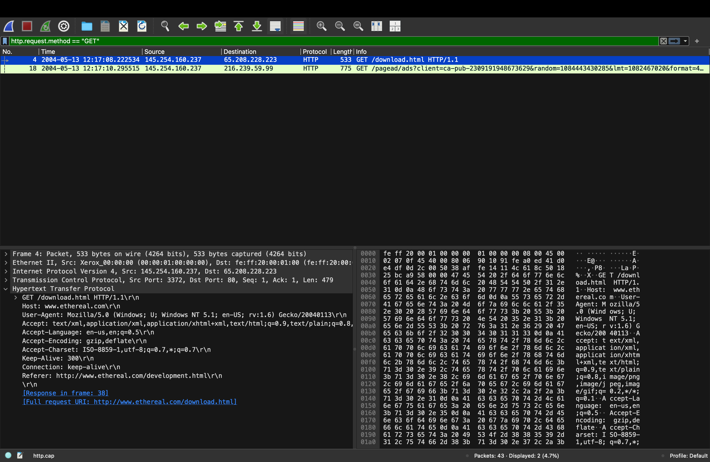
*Filter: `http.request.method == "GET"` — showing only 2 HTTP 
GET requests in the entire capture.*

**HTTP requests found:**
| Packet | Time | Source | Destination | Request |
|--------|------|--------|-------------|---------|
| 4 | 12:17:08 | 145.254.160.237 | 65.208.228.223 | GET /download.html |
| 18 | 12:17:10 | 145.254.160.237 | 216.239.59.99 | GET /pagead/ads?client=ca-pub-2309191948673629 |

**Packet 4 detail visible:**
- Host: www.ethereal.com
- Full URI: http://www.ethereal.com/download.html
- Referer: http://www.ethereal.com/development.html
- User-Agent: Mozilla/5.0 (Windows; U; Windows NT 5.1)

### HTTP Stream — Download Request
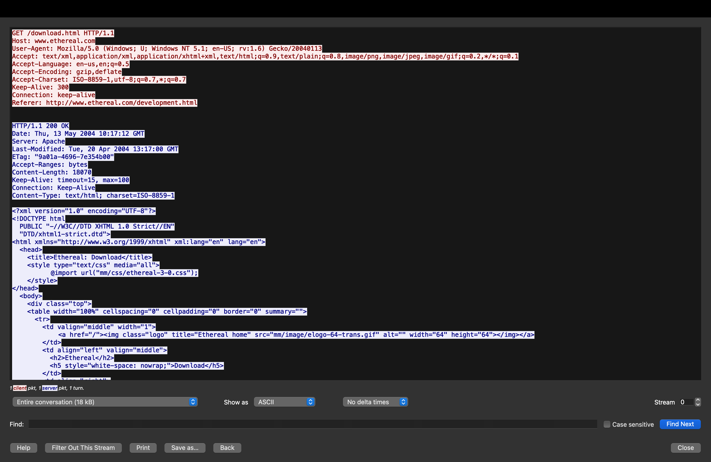
*Follow HTTP Stream on packet 4 — shows complete request 
and response conversation.*

**Request headers captured:**
GET /download.html HTTP/1.1
Host: www.ethereal.com
User-Agent: Mozilla/5.0 (Windows; U; Windows NT 5.1; en-US; rv:1.6) Gecko/20040113
Accept: text/xml,application/xml,application/xhtml+xml,text/html;q=0.9
Accept-Language: en-us,en;q=0.5
Accept-Encoding: gzip,deflate
Accept-Charset: ISO-8859-1,utf-8;q=0.7,*;q=0.7
Keep-Alive: 300
Connection: keep-alive
Referer: http://www.ethereal.com/development.html

### Server Response
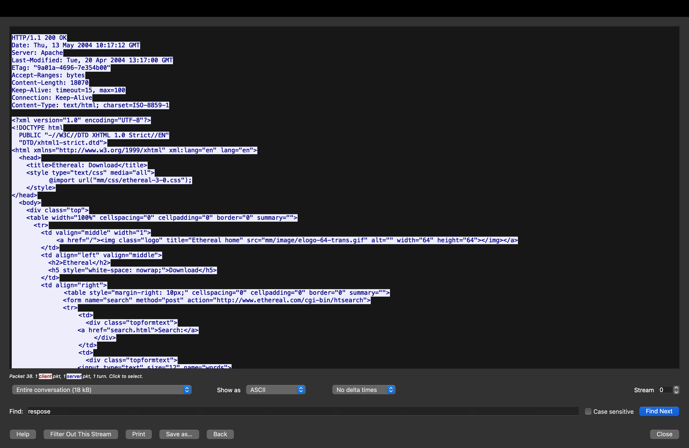
*Server response showing HTTP 200 OK and full HTML content 
of the download page.*

**Response headers:**
HTTP/1.1 200 OK
Date: Thu, 13 May 2004 10:17:12 GMT
Server: Apache
Last-Modified: Tue, 20 Apr 2004 13:17:00 GMT
Content-Length: 18070
Content-Type: text/html; charset=ISO-8859-1

**Key findings:**
- Server software: Apache (version not disclosed — good practice)
- Page title: "Ethereal: Download"
- Content length: 18,070 bytes (18 kB)
- Response code 200 OK — successful request

**SOC relevance:** HTTP stream reconstruction shows exactly 
what was requested and what the server returned. In a real 
investigation this reveals if sensitive data was accessed, 
what files were downloaded, and whether the server response 
contained anything malicious.

---

## Task 4 — HTTP Object Extraction
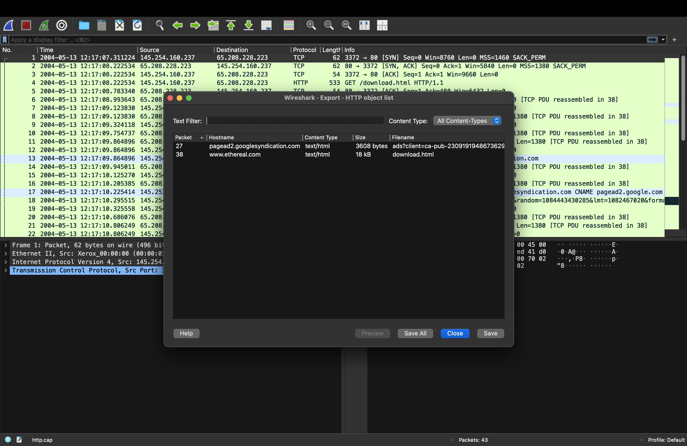
*File → Export Objects → HTTP showing all files transferred 
over HTTP in this capture.*

**Files transferred:**
| Packet | Hostname | Content Type | Size | Filename |
|--------|----------|-------------|------|----------|
| 27 | pagead2.googlesyndication.com | text/html | 3,608 bytes | ads?client=ca-pub-2309191948673629 |
| 38 | www.ethereal.com | text/html | 18 kB | download.html |

**SOC relevance:** HTTP object extraction is a critical SOC 
and DFIR skill. In a real incident, a SOC analyst extracts 
all files from a packet capture to check for:
- Malware delivered as executable files
- Stolen data being exfiltrated
- Malicious scripts embedded in web pages
- Suspicious file types being transferred

In this capture, both files are HTML — no malicious files 
detected. However, the Google Syndication ad request (3,608 
bytes) is worth noting as ad networks are sometimes abused 
for malvertising campaigns.

---

## Task 5 — DNS Analysis
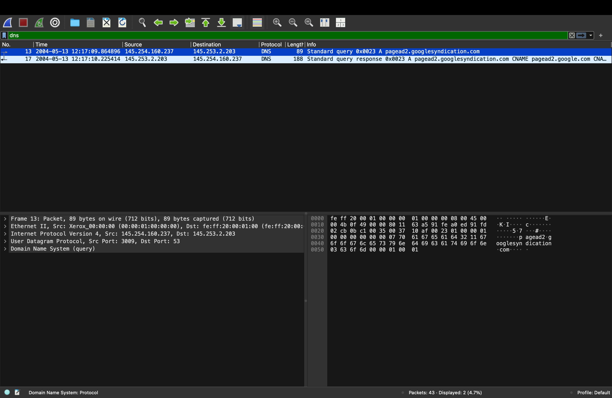
*Filter: `dns` — showing only 2 DNS packets in the capture.*

**DNS packets:**
| Packet | Time | Type | Query | Result |
|--------|------|------|-------|--------|
| 13 | 12:17:09 | Query | pagead2.googlesyndication.com | — |
| 17 | 12:17:10 | Response | pagead2.googlesyndication.com | CNAME pagead2.google.com |

### DNS Query Detail
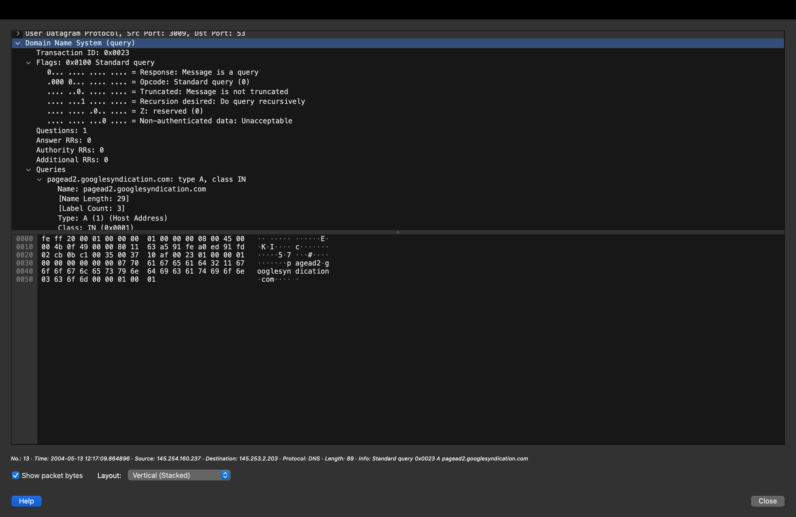
*Expanded DNS query packet showing full structure.*

**DNS query analysis:**
| Field | Value |
|-------|-------|
| Transaction ID | 0x0023 |
| Message type | Query |
| Opcode | Standard query (0) |
| Recursion desired | Yes — client wants DNS server to resolve recursively |
| Questions | 1 |
| Answer RRs | 0 — no answer yet |
| Query name | pagead2.googlesyndication.com |
| Query type | A (Host Address — IPv4) |
| Source port | 3009 |
| Destination port | 53 (DNS standard port) |

**SOC relevance:** DNS analysis is one of the most important 
SOC skills because:
- Malware uses DNS for C2 (Command and Control) communication
- DNS tunneling can be used to exfiltrate data
- Domain generation algorithms (DGA) used by malware produce 
  unusual domain patterns visible in DNS traffic
- Suspicious domains queried by endpoints are immediate 
  red flags in a SOC investigation

In this capture, only one domain was queried — 
pagead2.googlesyndication.com — a legitimate Google 
advertising domain. No suspicious DNS activity detected.

---

## Task 6 — TCP Handshake Analysis

### Initial SYN Only
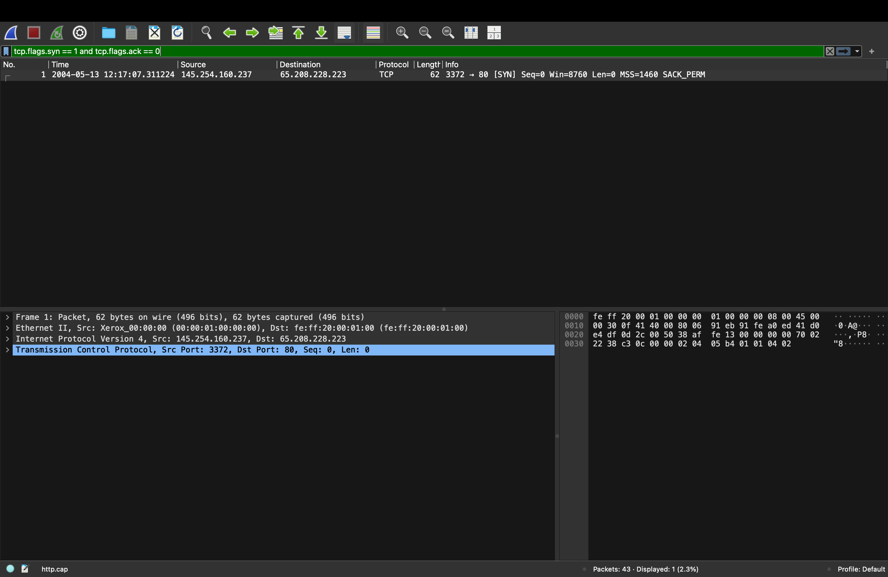
*Filter: `tcp.flags.syn == 1 and tcp.flags.ack == 0`*
*Shows only the first step of TCP handshakes — client initiating connections.*

**Finding:** Only 1 SYN packet — Packet 1
- Source: 145.254.160.237 (client)
- Destination: 65.208.228.223 (web server)
- Port: 3372 → 80
- This is the only connection initiation in the capture

### Full SYN Traffic
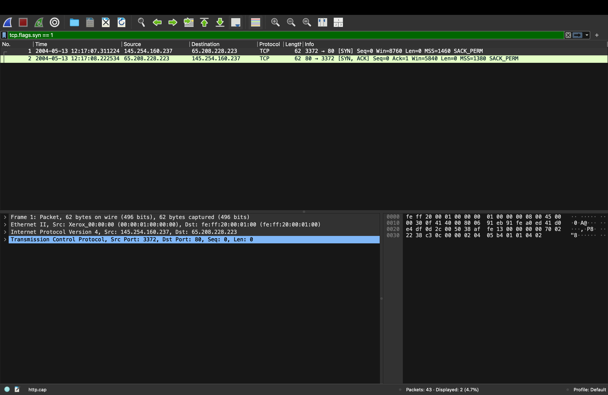
*Filter: `tcp.flags.syn == 1`*
*Shows both SYN and SYN-ACK packets — both sides of handshake.*

**Packets shown:**
| Packet | Direction | Flags | Meaning |
|--------|-----------|-------|---------|
| 1 | Client → Server | SYN | Client initiates connection |
| 2 | Server → Client | SYN-ACK | Server accepts connection |

**Complete TCP 3-way handshake:**
1. Packet 1: SYN (client → server) — "I want to connect"
2. Packet 2: SYN-ACK (server → client) — "OK, I accept"
3. Packet 3: ACK (client → server) — "Great, connection established"

**SOC relevance:** TCP handshake analysis is essential for:
- Detecting port scans — many SYN packets with no SYN-ACK responses
- Identifying half-open connections — sign of SYN flood attack
- Detecting connection resets — RST packets indicate 
  refused or terminated connections
- Mapping which services are being accessed on which ports

In this capture, the handshake is clean and complete — 
one connection, successfully established. No port scanning 
or suspicious connection patterns detected.

---

## Task 7 — User-Agent Analysis
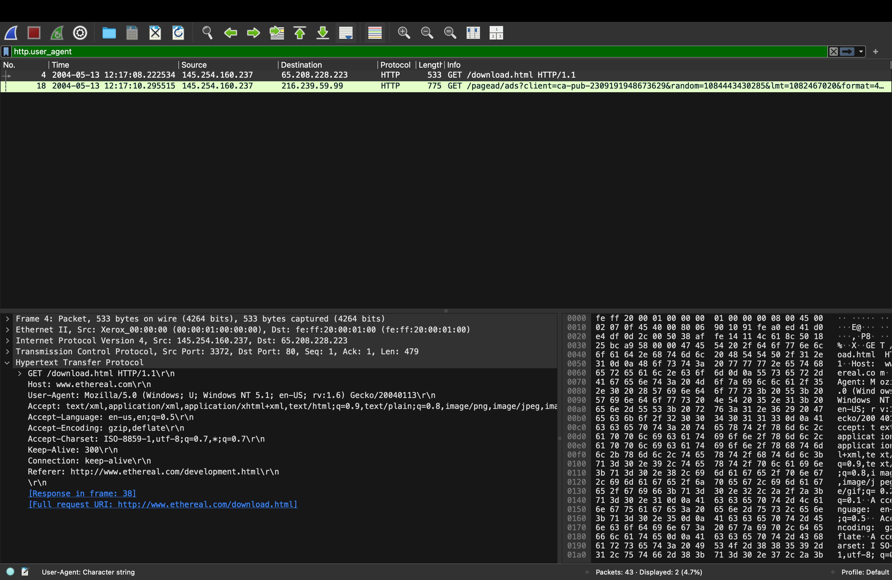
*Filter: `http.user_agent` — showing HTTP packets containing 
User-Agent headers.*

### User-Agent Detail
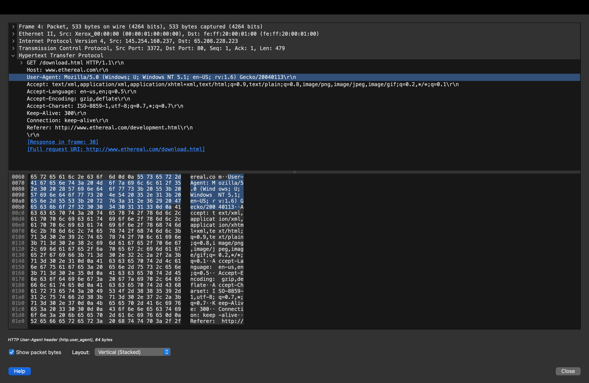
*Expanded HTTP layer showing full User-Agent string for packet 4.*

**User-Agent string found:**
Mozilla/5.0 (Windows; U; Windows NT 5.1; en-US; rv:1.6) Gecko/20040113

**User-Agent breakdown:**
| Component | Value | Meaning |
|-----------|-------|---------|
| Mozilla/5.0 | Mozilla/5.0 | Standard browser identifier |
| Windows; U | Windows; U | Windows OS, user-controlled |
| Windows NT 5.1 | Windows NT 5.1 | Windows XP |
| en-US | en-US | US English language |
| rv:1.6 | rv:1.6 | Gecko engine version 1.6 |
| Gecko/20040113 | Gecko/20040113 | Firefox-based browser, Jan 2004 |

**Additional HTTP headers visible:**
- Accept-Language: en-us,en;q=0.5
- Accept-Encoding: gzip,deflate
- Connection: keep-alive
- Referer: http://www.ethereal.com/development.html

**SOC relevance:** User-Agent analysis is critical because:
- Malware often uses hardcoded or unusual User-Agent strings
- Automated tools (scanners, bots) use non-browser User-Agents
- Mismatched User-Agents (e.g. claiming to be Chrome but 
  with Linux UA on Windows machine) indicate spoofing
- Known malware families have documented User-Agent signatures

In this capture, the User-Agent is consistent with a genuine 
Firefox browser on Windows XP from 2004 — legitimate traffic.

---

## Task 8 — Packet Length Analysis
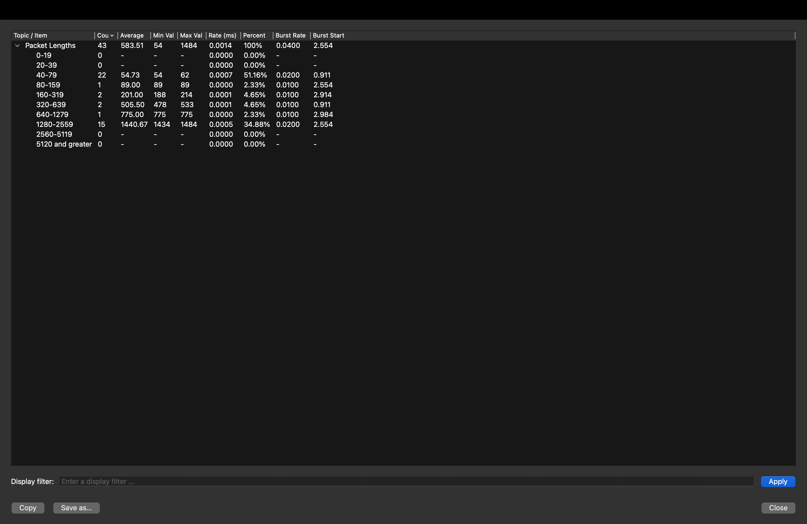
*Statistics → Packet Lengths showing size distribution 
across all 43 packets.*

**Packet size distribution:**
| Size Range | Count | Percentage | Significance |
|------------|-------|------------|-------------|
| 0-19 bytes | 0 | 0% | No tiny packets |
| 20-39 bytes | 0 | 0% | — |
| 40-79 bytes | 22 | 51.16% | TCP ACK packets — control traffic |
| 80-159 bytes | 1 | 2.33% | DNS query packet |
| 160-319 bytes | 2 | 4.65% | DNS response + small HTTP |
| 320-639 bytes | 2 | 4.65% | HTTP request packets |
| 640-1279 bytes | 1 | 2.33% | Medium data packet |
| 1280-2559 bytes | 15 | 34.88% | Large data transfer packets |

**Key statistics:**
- Total packets: 43
- Average packet size: 583.51 bytes
- Minimum packet: 54 bytes (TCP ACK)
- Maximum packet: 1,484 bytes (data transfer)

**SOC relevance:** Packet size analysis helps detect:
- Data exfiltration — unusually large outbound packets
- DNS tunneling — DNS packets larger than 512 bytes are suspicious
- Covert channels — traffic patterns inconsistent with 
  claimed protocol
- DoS attacks — floods of small packets (SYN flood)

In this capture, the 15 large packets (1280-2559 bytes) are 
all TCP data transfer packets carrying the downloaded HTML 
content — completely normal. No anomalies detected.

---

## Task 9 — Traffic Timeline
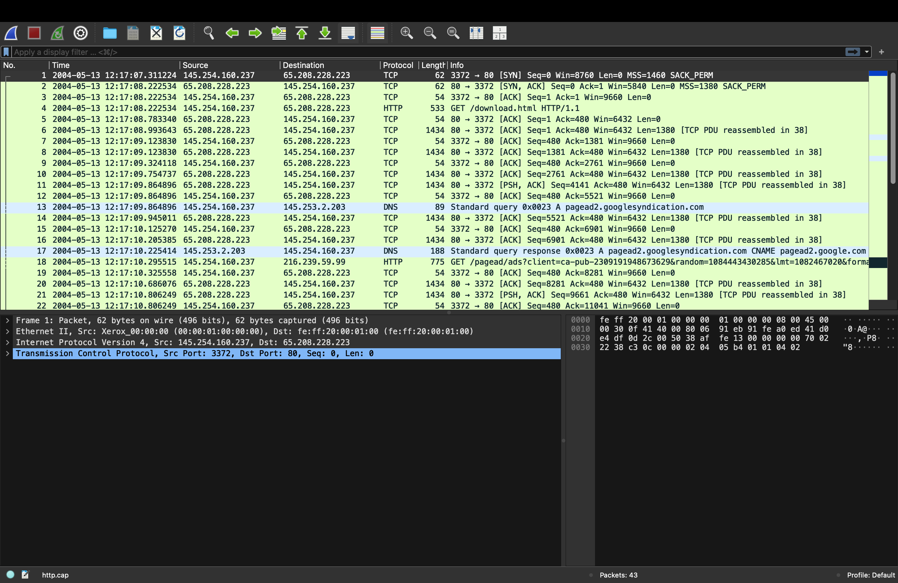
*Full packet list with Date and Time display format showing 
complete chronological timeline of all 43 packets.*

**Attack timeline reconstruction:**
| Time | Event |
|------|-------|
| 12:17:07.311 | TCP SYN — client initiates connection to web server |
| 12:17:08.222 | TCP SYN-ACK — server accepts |
| 12:17:08.222 | TCP ACK — handshake complete |
| 12:17:08.222 | HTTP GET /download.html — first request |
| 12:17:08–09 | Server sends HTTP response in multiple TCP segments |
| 12:17:09.864 | DNS query for pagead2.googlesyndication.com |
| 12:17:10.225 | DNS response — CNAME pagead2.google.com |
| 12:17:10.295 | HTTP GET /pagead/ads — Google ad request |
| 12:17:10–11 | Ad server responds with ad content |

**Total session duration:** ~30 seconds
**All activity:** 2004-05-13 between 12:17:07 and 12:17:40

**SOC relevance:** Timeline reconstruction is a core incident 
response skill. Every SOC investigation requires building a 
precise timeline of events to understand exactly what happened, 
in what order, and when. This allows analysts to determine 
the initial attack vector, the sequence of attacker actions, 
and the full scope of the incident.

---

## Task 10 — Packet Dissection Export
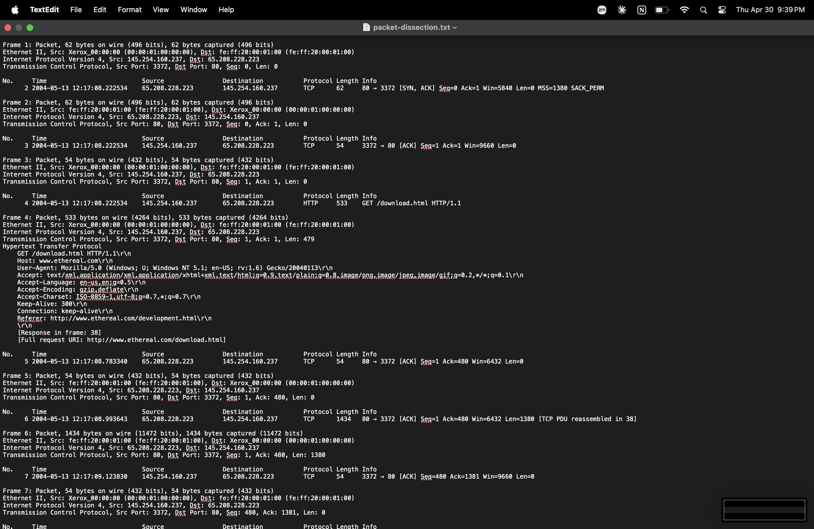
*File → Export Packet Dissections → As Plain Text — exporting 
complete packet analysis to a text file for documentation.*

**Export contains:**
- Full packet details for all 43 packets
- Ethernet, IP, TCP, and HTTP layer information
- All header fields parsed and labelled
- Raw data in hex and ASCII

**SOC relevance:** Exporting packet dissections is standard 
practice in SOC and DFIR work for:
- Creating permanent evidence records
- Sharing findings with other analysts
- Including evidence in incident reports
- Archiving for legal or compliance purposes

---

## Summary of Findings

| Category | Finding | Verdict |
|----------|---------|---------|
| Network participants | 4 IPs — client, web server, DNS, ad server | ✅ Normal |
| HTTP requests | 2 GET requests — download.html and Google ads | ✅ Normal |
| Files transferred | download.html (18kB) and Google ad HTML | ✅ Normal |
| DNS queries | 1 query for googlesyndication.com | ✅ Normal |
| TCP handshake | 1 clean 3-way handshake | ✅ Normal |
| User-Agent | Firefox on Windows XP — consistent | ✅ Normal |
| Packet sizes | Normal distribution — no exfiltration anomalies | ✅ Normal |
| Session duration | ~30 seconds — single web page visit | ✅ Normal |

**Overall verdict: No malicious activity detected**

This capture represents a normal HTTP web browsing session — 
a user on Windows XP visited the Ethereal (now Wireshark) 
download page in May 2004. All traffic patterns, protocols, 
and data volumes are consistent with legitimate web browsing.

---

## MITRE ATT&CK — Techniques This Lab Helps Detect

| Technique | ID | How Wireshark Detects It |
|-----------|-----|--------------------------|
| Exfiltration Over C2 Channel | T1041 | Large outbound packets to unknown IPs |
| DNS Tunneling | T1071.004 | Oversized DNS packets, unusual query patterns |
| Network Sniffing | T1040 | Passive capture of credentials in cleartext |
| Adversary-in-the-Middle | T1557 | Unexpected ARP responses, certificate mismatches |
| Automated Exfiltration | T1020 | High-volume outbound transfers at unusual hours |

---

## Key Learnings
- Wireshark filters allow rapid isolation of specific 
  traffic types — essential skill for SOC triage
- HTTP stream reconstruction reveals the complete 
  conversation between client and server
- File extraction from PCAPs is critical for malware 
  analysis and evidence collection
- DNS analysis reveals domain resolution patterns — 
  malware C2 often visible here first
- TCP handshake analysis detects scanning and DoS attacks
- User-Agent strings can fingerprint the client and 
  reveal spoofing or automation
- Packet size distribution helps detect data exfiltration
- Timeline reconstruction is the foundation of every 
  incident investigation
